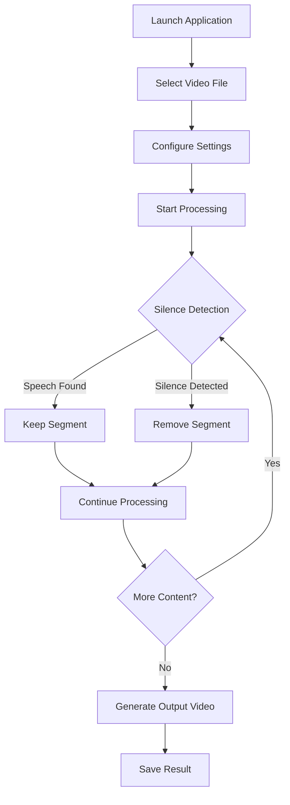

## 1. Product Overview
A minimal Python-based video editor that automatically detects and removes silent sections from videos, keeping only the parts where speech is detected. This tool helps content creators save time by eliminating manual video editing of dead air and pauses.

The product solves the problem of lengthy videos with unnecessary silent segments, making content more engaging and concise for viewers.

## 2. Core Features

### 2.1 User Roles
This is a single-user desktop application with no user authentication required.

### 2.2 Feature Module
Our video editor consists of the following main pages:
1. **Main Interface**: File selection, processing controls, progress display.
2. **Settings Panel**: Silence threshold configuration, output settings.

### 2.3 Page Details

| Page Name | Module Name | Feature description |
|-----------|-------------|---------------------|
| Main Interface | File Selection | Browse and select video files from local system. |
| Main Interface | Processing Controls | Start/stop video processing with visual feedback. |
| Main Interface | Progress Display | Show current processing status and estimated time remaining. |
| Main Interface | Preview Section | Display original video duration and expected output duration. |
| Settings Panel | Silence Detection | Configure silence threshold (dB level) and minimum silence duration. |
| Settings Panel | Output Settings | Choose output format, quality, and save location. |
| Settings Panel | Advanced Options | Enable/disable audio normalization and fade transitions. |

## 3. Core Process
The user workflow involves selecting a video file, configuring silence detection parameters, and processing the video to remove silent sections.

## 4. User Interface Design

### 4.1 Design Style
- **Primary Color**: Dark theme with #2D3748 background
- **Secondary Color**: Blue accents (#4299E1) for buttons and progress indicators
- **Button Style**: Flat design with rounded corners (8px border-radius)
- **Font**: System default fonts, 14px for body text, 16px for headers
- **Layout**: Single-window application with tabbed interface
- **Icons**: Minimalist line icons for file operations and settings

### 4.2 Page Design Overview

| Page Name | Module Name | UI Elements |
|-----------|-------------|-------------|
| Main Interface | File Selection | Drag-and-drop zone with file browser button, supported formats display. |
| Main Interface | Processing Controls | Large "Process Video" button with cancel option, status text below. |
| Main Interface | Progress Display | Progress bar with percentage, time elapsed/remaining, current operation. |
| Settings Panel | Silence Detection | Slider for threshold (-60 to -20 dB), input field for minimum duration. |
| Settings Panel | Output Settings | Dropdown for format selection (MP4, AVI, MOV), quality slider, save path. |

### 4.3 Responsiveness
Desktop-first application designed for Windows, macOS, and Linux with fixed window size (800x600px) optimized for video editing workflows.