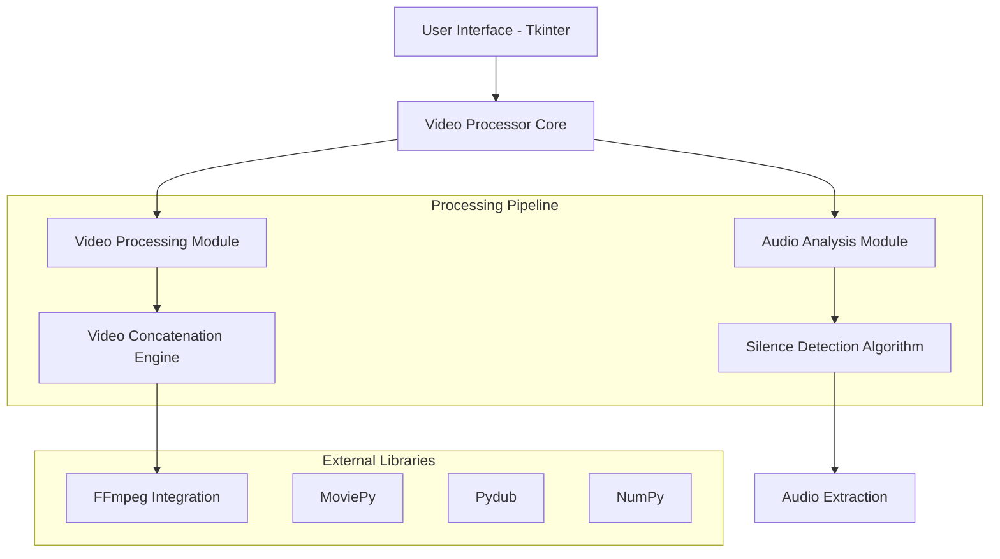

## 1. Architecture Design



## 2. Technology Description

- **Language**: Python 3.8+
- **GUI Framework**: Tkinter (built-in, cross-platform)
- **Video Processing**: MoviePy 1.0.3
- **Audio Processing**: Pydub 0.25.1
- **Audio Analysis**: Librosa 0.10.0
- **Numerical Computing**: NumPy 1.24.0
- **File Operations**: Built-in Python libraries

## 3. Core Components

### 3.1 Main Application Structure
```
quick-cut/
├── main.py                 # Application entry point
├── gui/
│   ├── __init__.py
│   ├── main_window.py     # Main UI implementation
│   └── settings_dialog.py # Settings configuration
├── processor/
│   ├── __init__.py
│   ├── video_processor.py # Core processing logic
│   ├── audio_analyzer.py  # Silence detection
│   └── video_editor.py    # Video manipulation
├── utils/
│   ├── __init__.py
│   ├── file_utils.py     # File operations
│   └── validators.py     # Input validation
└── config/
    ├── __init__.py
    └── settings.py         # Configuration management
```

### 3.2 Key Classes and Methods

| Component | Class | Primary Methods |
|-----------|--------|-----------------|
| Video Processor | VideoProcessor | process_video(), extract_audio(), create_segments() |
| Audio Analyzer | AudioAnalyzer | detect_silence(), find_speech_segments(), calculate_threshold() |
| Video Editor | VideoEditor | concatenate_segments(), apply_transitions(), export_video() |
| GUI Manager | MainWindow | select_file(), update_progress(), show_results() |

## 4. Processing Algorithm

### 4.1 Silence Detection Algorithm
```python
# Pseudo-code for silence detection
def detect_silence(audio_segment, threshold=-40, min_duration=0.5):
    # Convert to numpy array
    samples = audio_segment.get_array_of_samples()
    
    # Calculate RMS energy for each frame
    frame_length = int(audio_segment.frame_rate * 0.1)  # 100ms frames
    rms_values = []
    
    for i in range(0, len(samples), frame_length):
        frame = samples[i:i+frame_length]
        rms = np.sqrt(np.mean(frame**2))
        rms_values.append(rms)
    
    # Convert to dB and detect silence
    silence_segments = []
    for i, rms in enumerate(rms_values):
        db_level = 20 * np.log10(rms) if rms > 0 else -60
        if db_level < threshold:
            # Mark as silence if duration exceeds minimum
            silence_segments.append((i * 0.1, (i + 1) * 0.1))
    
    return merge_adjacent_segments(silence_segments, min_duration)
```

### 4.2 Video Segmentation Process


## 5. Configuration Settings

### 5.1 Silence Detection Parameters
| Parameter | Type | Default | Range | Description |
|-----------|------|---------|--------|-------------|
| threshold | float | -40.0 | -60 to -20 dB | Audio level below which is considered silence |
| min_duration | float | 0.5 | 0.1 to 5.0 sec | Minimum silence duration to remove |
| fade_duration | float | 0.1 | 0.0 to 1.0 sec | Fade in/out duration for smooth transitions |

### 5.2 Output Settings
| Parameter | Options | Default | Description |
|-----------|---------|---------|-------------|
| format | MP4, AVI, MOV | MP4 | Output video format |
| quality | High, Medium, Low | Medium | Video quality and compression |
| resolution | Original, 1080p, 720p | Original | Output video resolution |

## 6. Performance Considerations

### 6.1 Memory Management
- Process video in chunks to handle large files efficiently
- Use temporary files for intermediate processing steps
- Implement progress callbacks for long operations

### 6.2 Processing Optimization
- Parallel processing for audio analysis and video segmentation
- GPU acceleration support through MoviePy (when available)
- Efficient audio analysis using sliding window approach

### 6.3 Error Handling
- Graceful handling of corrupted video files
- Validation of audio streams before processing
- User-friendly error messages with suggested solutions

## 7. Dependencies and Installation

### 7.1 Required Python Packages
```
# requirements.txt
moviepy==1.0.3
pydub==0.25.1
librosa==0.10.0
numpy==1.24.0
imageio-ffmpeg==0.4.8
```

### 7.2 System Requirements
- **Operating System**: Windows 10+, macOS 10.14+, Ubuntu 18.04+
- **RAM**: Minimum 4GB, Recommended 8GB+
- **Storage**: 2GB free space for temporary files
- **Python**: Version 3.8 or higher

### 7.3 FFmpeg Installation
The application requires FFmpeg for video processing:
```bash
# Windows
pip install imageio-ffmpeg

# macOS
brew install ffmpeg

# Ubuntu/Debian
sudo apt-get install ffmpeg
```